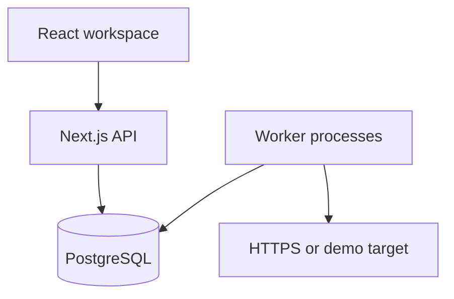

# Engineering notes

## Scope and stack

Relay is for one person keeping track of recurring HTTP work: checking a service, triggering an export or calling a webhook. The useful unit is a saved job plus a durable record of each run. I kept the feature set small so a failed request has a clear explanation and a next action.

I chose Next.js and TypeScript for both the UI and API, PostgreSQL for persistence, and a separate TypeScript worker. The assignment allows an alternative to C#. Sharing validation and execution types removes a second build and deployment toolchain from this small project. The worker is still an independent process; an API request never executes a target or waits for it to finish.

PostgreSQL is also the queue. At this scale a queue table makes accepting a run and storing its job snapshot one transaction. Introducing Redis or a broker would add another service and a cross-system consistency problem without a demonstrated need. SQL is parameterized, migrations are versioned and checksum checked, and schema constraints protect invariants even if application code makes a mistake.

## Architecture

The API checks session ownership, validates input and commits a queued execution. Workers claim eligible work, make an HTTP request outside the database transaction, then save the result. The UI polls stored state. Vercel hosts the web/API; PostgreSQL and the always-running worker are separate deployment resources.

`jobs` hold mutable configuration and a version. `executions` hold an immutable JSON snapshot and the current run state. `attempts` preserve each dispatch, including interrupted ones. `execution_logs` hold ordered events. `run_requests` maps a user's idempotency keys to accepted executions. `sessions`, `rate_limits` and `workers` hold authentication and runtime state. Composite foreign keys tie each execution to its job's owner.

## Concurrency, retries and recovery

Workers claim rows using `FOR UPDATE SKIP LOCKED` in a short transaction. Claiming increments the attempt number, creates an attempt record and grants a random lease token valid for 45 seconds. Active workers renew every 10 seconds. A completion is accepted only while that exact token still owns an unexpired running execution. A worker that returns after losing its lease cannot overwrite a replacement worker's result.

A partial unique index allows at most one queued, running or retry-waiting execution per job. Enqueuers lock the job; a transaction advisory lock additionally serializes the same user/idempotency key across different jobs. Duplicate run clicks return the active execution. Reusing the same key after a lost response returns the original execution, even after it finishes. Cross-job reuse returns 409. Keys are scoped to an account and retained with history.

Retryable errors are timeouts, network errors, HTTP 429 and HTTP 5xx. Other HTTP failures stop immediately. A job permits zero to three retries after its first attempt. Automatic retries use the same execution ID, immutable configuration and outbound `Idempotency-Key`; delays use exponential backoff with small jitter. A manual retry creates a linked execution with the current job settings and a new outbound key.

Every worker also checks expired leases. Recovery records an interrupted attempt and retries only when budget remains; the last lost attempt becomes a visible failure. If PostgreSQL is unavailable, the API returns 503 and workers back off. If a result cannot be committed, the persisted lease eventually expires and recovery takes over. Work is not held only in process memory. Shutdown lets the current bounded attempt finish; a hard kill is handled through the lease.

**External side effects are at least once.** The target may accept a request just before the worker crashes or the network times out. A lease prevents stale database writes, not duplicate external effects. Automatic retries send a stable key so a cooperative target can deduplicate. Relay cannot promise exactly-once delivery to an arbitrary service. The timeout and lease-expiry messages state this uncertainty. Cancellation is available only before dispatch or between attempts.

Schedules use UTC and a small fixed set of intervals. Scheduler claims use row locks too. Missed slots are coalesced into one run, and overlaps are skipped while advancing the next due time. This avoids a burst of stale external calls after downtime. Pause and archive stop future acceptance and scheduling; already accepted work continues. Archiving hides a job while preserving its history. Editing a job requires its current version, so a stale tab receives 409 rather than silently overwriting another edit.

## Authentication and outbound requests

Passwords use salted scrypt hashes. Random sessions are stored as SHA-256 hashes, expire after seven days, and use HttpOnly, SameSite=Lax cookies that are Secure in production. Logout invalidates the server-side session. Every data query or mutation is scoped to the authenticated owner. Cross-origin mutations are rejected; auth attempts and mutations use database-backed rate limits. The deployment must use a trusted reverse proxy for forwarded IP headers. API responses contain concise errors and a request ID; server logs contain structured events.

External jobs require an exact hostname allowlist, HTTPS, port 443 and no embedded credentials. At execution time, all DNS answers are checked for private or reserved addresses and a checked address is pinned for the request. Redirects are not followed. Response bodies are capped at 64 KB; only a 2,000-character excerpt is stored. Timeouts are bounded to 1–15 seconds. Public demo targets require no external network access and are clearly labeled as simulated outcomes. Arbitrary scripts and secret-bearing custom headers are outside scope.

## Tests and known limits

Tests exercise authorization, duplicate submission, bounded retries, immutable snapshots, interrupted attempts, fencing, schedule handling, cancellation and session expiry. Native PostgreSQL tests additionally hold real row locks and race independent clients. CI runs them against PostgreSQL 16. Local PGlite tests validate SQL and state transitions, but its single backend cannot establish multi-session locking behavior. [VERIFICATION.md](VERIFICATION.md) distinguishes completed checks from pending ones.

The main limits are deliberate: there is no email verification, password reset, shared workspace, arbitrary cron syntax, custom request body, retention policy or restore UI for archived jobs. History and idempotency keys grow until an operator adds retention. A user can keep 100 unarchived jobs; history is paginated in batches of 50. Polling every two seconds and a small connection pool suit an assignment-sized deployment, not large scale. Worker heartbeat metadata is shared across accounts, while all job and execution data remains private. Duration is the most recent attempt's request time, excluding queue and retry waits. The application does not mask sensitive text returned by an allowlisted target, so only suitable endpoints should be configured.

The next improvements would be retention with an explicit idempotency window, target secret management, verified account recovery, and operational metrics for queue age and expired leases. For this submission, reliable execution and understandable failures took priority over adding more job types.

AI tools helped with implementation, review and test generation. These notes describe the actual design and its limitations; they are not a claim of unaided authorship or production certification.
